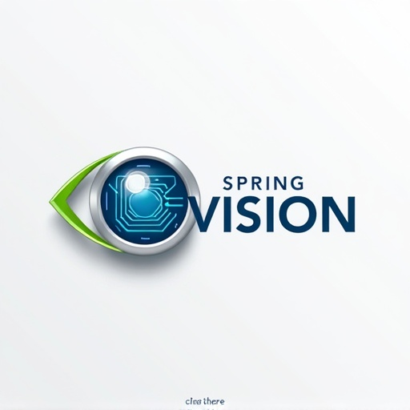

# 🤖 Spring-Vision

<div align="center">
  
</div>

<div align="center">

**🚀 The seamless, idiomatic Computer Vision starter for the Spring Boot ecosystem.**  
**🎯 Bring AI-powered image, object, and face detection to your modern Java apps—professionally, cleanly, and extensibly.**

[](https://openjdk.org/)
[](https://spring.io/projects/spring-boot)
[](https://opencv.org/)
[](LICENSE)

</div>

---

## 📋 Overview

Spring-Vision is an open source project designed to empower Spring Boot developers with production-ready computer vision capabilities—starting with OpenCV, and set up for easy plug-in of additional backends such as MediaPipe, YOLO, InsightFace, and more.

### ✨ Key Highlights

- **🏢 Enterprise-Grade Spring Integration:** Out of the box, autoconfigured `VisionTemplate` bean for rapid adoption, just like `RestTemplate` or `JmsTemplate`.
- **☕ Modern Java Only:** Built to leverage Java 21+ features (records, pattern matching, Virtual Threads via Project Loom), idiomatic naming, and full Javadoc on every public class and method.
- **🔄 Multiple Backends, Easy Switching:** Native (OpenCV/JNI, FFM API), remote (Python microservice), or hybrid backends—flexible by config.
- **🧹 Clean, Stable, and Extensible:** Every class and method fully documented, with strong conventions to ensure readability and contributor friendliness.

---

## 🚀 Features

- 🔌 **Plug-and-play** computer vision for Spring Boot apps
- 🎯 **Built-in support:** OpenCV; placeholders for MediaPipe and YOLO
- ⚙️ **Spring autoconfig**, metrics/actuator endpoints, SPI for adding custom vision providers
- ⚡ **Async, scalable I/O** (virtual threads)
- ☁️ **Ready for cloud native** deployments and GraalVM builds
- 💯 **100% professional, transparent, senior-level code:** all public APIs documented, extensive testing, robust process and contribution rules

---

## 🚀 Quick Start

### 🏗️ Building from Source

```bash
# Clone the repository
git clone https://github.com/codesapienbe/spring-vision.git
cd spring-vision

# Build all modules including examples
mvn clean install

# Build specific modules
mvn clean install -pl spring-vision-core,spring-vision-starter
mvn clean install -pl spring-vision-examples
```

### 📦 Maven Dependency

```xml
<dependency>
    <groupId>com.springvision</groupId>
    <artifactId>spring-vision-starter</artifactId>
    <version>1.0.0-SNAPSHOT</version>
</dependency>
```

### 🌐 Spring Initializr *(pending full release)*

- Will be listed as "Computer Vision (spring-vision)" among dependencies.

### 🎯 Running Examples

After building the project, you can run any of the example applications:

```bash
# Basic Face Detection (Web UI)
cd spring-vision-examples/basic-face-detection
mvn spring-boot:run

# GWT Application
cd spring-vision-examples/gwt-application
mvn spring-boot:run

# Vaadin Application
cd spring-vision-examples/vaadin-application
mvn spring-boot:run

# JavaFX Desktop Application
cd spring-vision-examples/javafx-application
mvn javafx:run

# PicoCLI Command Line Application
cd spring-vision-examples/picocli-application
mvn spring-boot:run -- -h
```

### ⚙️ Configuration Example

```yaml
vision:
  enabled: true
  backend: opencv       # Options: opencv, mediapipe, yolo, your-custom-backend
```

---

## 💻 Usage Example

```java
import com.springvision.template.VisionTemplate;
import com.springvision.model.ImageData;

@Autowired
private VisionTemplate visionTemplate;

public void runDetection(InputStream image) {
    ImageData data = ImageData.fromStream(image);
    VisionResult result = visionTemplate.detectFaces(data);
    // Process VisionResult: bounding boxes, confidence, etc.
}
```

---

## 🔧 Supported Backends

| Backend     | Tech         | Mode      | Status     |
|-------------|--------------|-----------|------------|
| 🎯 OpenCV      | Native       | JVM       | 🚧 Beta    |
| 🤖 MediaPipe   | Python API   | Webhook   | ⏳         |
| 🎯 YOLO        | Python API   | Webhook   | ⏳         |
| 🔍 InsightFace | Python API   | Planned   | ⏳         |
| 🔌 Custom      | SPI/Plugin   | JVM/API   | ✅ Ready   |

> **💡 Note:** OpenCV backend gracefully handles missing native libraries by operating in fallback mode, ensuring application startup even when OpenCV native dependencies are not available.

---

## 📚 Documentation & Community

- **[📖 Getting Started](docs/GETTING_STARTED.md):** Setup, first app, and configuration
- **[📋 API Reference](docs/API_REFERENCE.md):** All beans, endpoints, and config
- **[🏗️ Architecture](docs/ARCHITECTURE.md):** Design rationale, extension points, backend approaches
- **[🤝 Contribution Guide](CONTRIBUTING.md):** All coding, formatting, and review standards

> All code follows strict, senior-level [Cursor IDE Rules](CURSOR_IDE_RULES.md) for clarity, maintainability, and long-term growth.  
> *Every public class and method is documented; contributors are expected to read and extend Javadoc, keep APIs idiomatic, and follow modern Java best practices.*

---

## 🗺️ Roadmap

- **🎯 Q3–Q4 2025:** Project bootstrap, OpenCV integration, first demos, metrics
- **🚀 Q1–Q2 2026:** MediaPipe & YOLO support, backend SPI, sample web clients
- **🤖 Q3–Q4 2026:** Advanced AI (InsightFace and others), asynchrony, cloud readiness
- **📦 Q1 2027+:** Docs, Spring Initializr, Maven Central, first official release

---

## 📄 License

[Apache License 2.0](LICENSE)

---

## 🤝 Get Involved

- **⭐ Star** the project to show your support!
- **🐛 Open Issues** and PRs for bug fixes, enhancements, and new backends
- **👥 Join the community**—see our [Code of Conduct](CODE_OF_CONDUCT.md)

---

<div align="center">

> *Spring-Vision aims to do for Computer Vision what Spring Boot did for APIs—make it **effortless**, **scalable**, and **approachable** for every JVM developer.*  
> — The Spring-Vision Team 🚀

</div>
